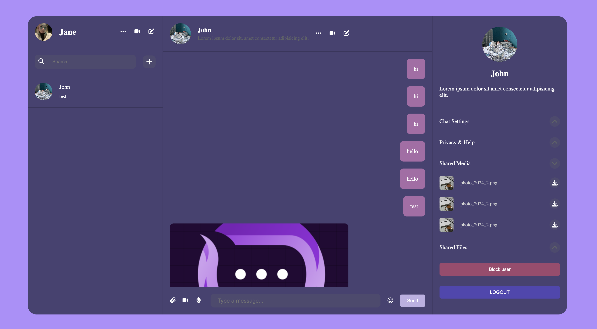

# ChatNetApp

ChatNetApp is a modern chat application built using React, Firebase, Zustand, and Vite. This application allows users to register, login, and engage in real-time chat, with functionalities like emoji support and toast notifications.




## Table of Contents

- [Features](#features)
- [Technologies Used](#technologies-used)
- [Installation](#installation)
- [Usage](#usage)
- [Deployment](#deployment)
- [Contributing](#contributing)
- [License](#license)

## Features

- User Authentication (Firebase Authentication)
- Real-time Chat (Firebase Firestore)
- Emoji Support (react-emoji)
- File Uploads (Firebase Storage)
- State Management (Zustand)
- Notifications (react-toastify)
- Fast Development Environment (Vite)
- Deployed on Vercel

## Technologies Used

- **React**: A JavaScript library for building user interfaces.
- **Firebase Storage**: Used for storing user-uploaded files.
- **Firebase Authentication**: Provides backend services for authentication.
- **Zustand**: A small, fast, and scalable bearbones state-management solution.
- **react-toastify**: A library for providing elegant toast notifications.
- **Vite**: A next-generation frontend tooling.
- **Vercel**: Deployment and hosting platform.

## Installation

1. **Clone the Repository**

   ```bash
   git clone https://github.com/ElenBlackwood/ChatNetApp.git
   cd ChatNetApp
