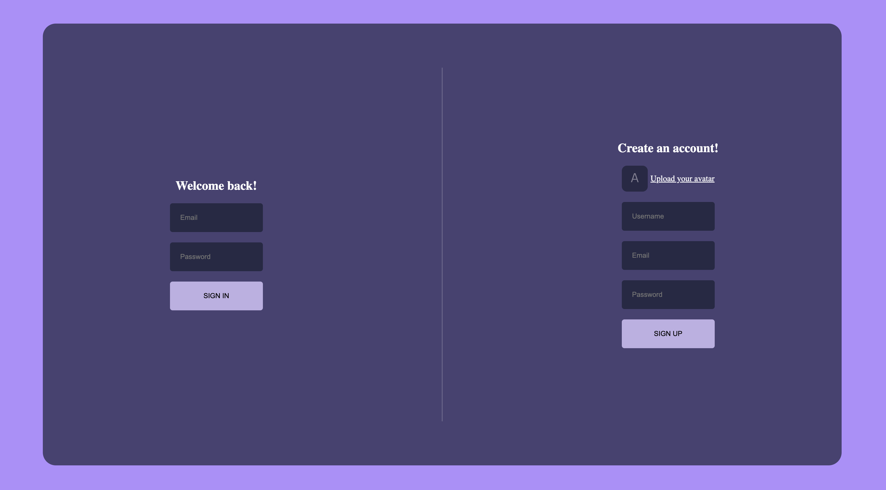

# ChatNetApp

ChatNetApp is a modern chat application built using React, Firebase, Zustand, and Vite. This application allows users to register, login, and engage in real-time chat, with functionalities like emoji support and toast notifications.




## Features

- User Authentication (Firebase Authentication)
- Real-time Chat (Firebase Firestore)
- Emoji Support (react-emoji)
- File Uploads (Firebase Storage)
- State Management (Zustand)
- Notifications (react-toastify)
- Fast Development Environment (Vite)
- Deployed on Vercel

## Technologies Used

- **React**: A JavaScript library for building user interfaces.
- **Firebase Storage**: Used for storing user-uploaded files.
- **Firebase Authentication**: Provides backend services for authentication.
- **Zustand**: A small, fast, and scalable bearbones state-management solution.
- **react-toastify**: A library for providing elegant toast notifications.
- **Vite**: A next-generation frontend tooling.
- **Vercel**: Deployment and hosting platform.

## Installation

1. **Clone the Repository**

   ```bash
   git clone https://github.com/ElenBlackwood/ChatNetApp.git
   cd ChatNetApp
   npm install
   npm run dev

2. **Firebase**
   You can create your Firebase account to set up authentication, Firestore, and storage in the future.
   Copy then  your Firebase config and replace the placeholder values in the project.

3. **Usage**

- Register and Login: Users can register and login using their email and password.
- Chat: Engage in real-time chat with other users.
- Emoji Support: Use emojis in your messages.
- File Uploads: Upload and share files in the chat.
- Notifications: Receive toast notifications for important events.

##Contributing
Contributions are welcome! Please create an issue or submit a pull request with your changes.

- Fork the repository
- Create your feature branch (git checkout -b feature/YourFeature)
- Commit your changes (git commit -m 'Add some feature')
- Push to the branch (git push origin feature/YourFeature)
- Open a pull request

##License
This project is licensed under the MIT License. See the LICENSE file for details.
   

